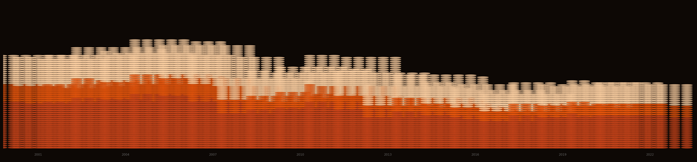
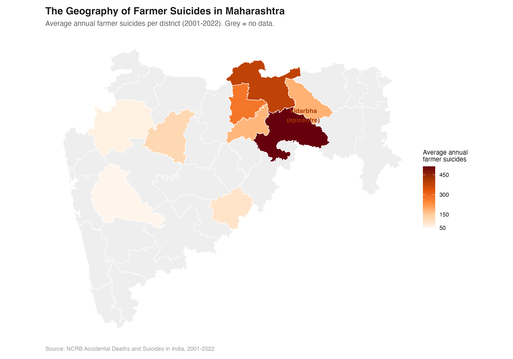
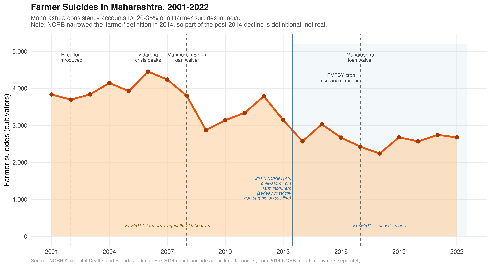
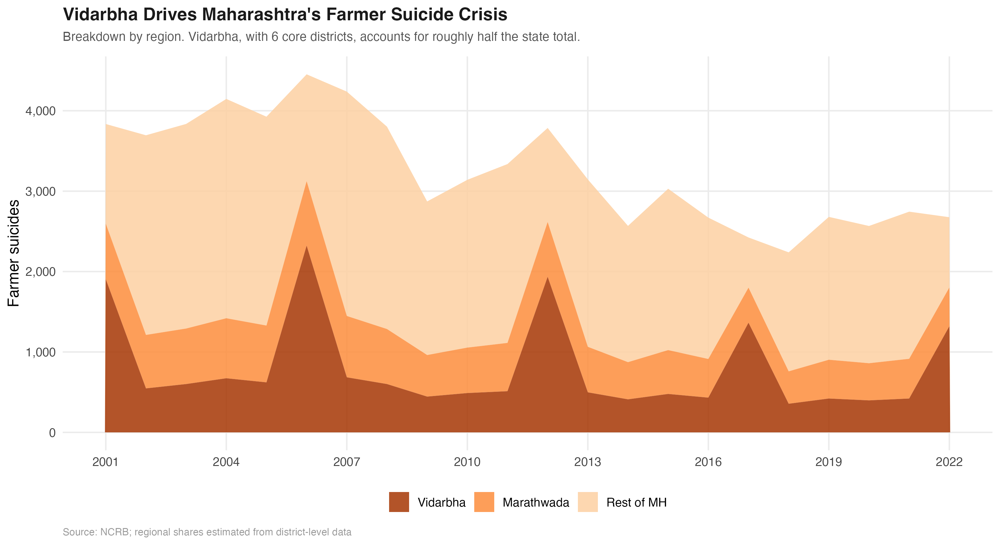
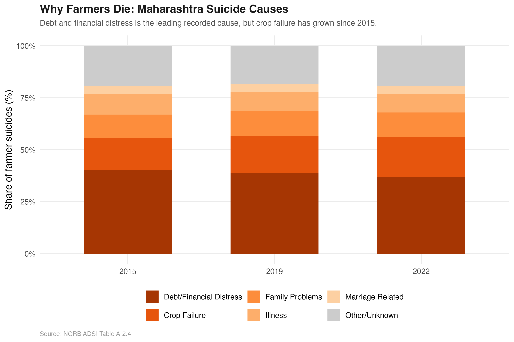

::: {.hero}
{.hero-img}

# Eight Per Day

::: {.subtitle}
Between 2001 and 2022, 66,000 farmers killed themselves in Maharashtra. Eight per day, every day, for two decades. This is what the data shows: where, when, why, and what the evidence says about whether anything has worked.
:::

::: {.meta}
Piyush Zaware · Northwestern Kellogg / University of Chicago
:::

::: {.badge-row}
::: {.badge-item}
66,000 Deaths
:::
::: {.badge-item}
22 Years
:::
::: {.badge-item}
36 Districts
:::
::: {.badge-item}
NCRB ADSI 2001–2022
:::
::: {.badge-item}
Choropleth · Time Series · Cause Analysis
:::
:::
:::

::: {.lead-para}
Every dot in the image above is ten farmer suicides. The tallest columns are the six Vidarbha districts at their 2006 peak, when Maharashtra recorded 4,453 farmer deaths in a single year. This project maps the National Crime Records Bureau's district-level data from 2001 to 2022 and reads the numbers against the policy responses of those two decades.
:::

::: {.abstract-box}
**Four findings from the data**

1. **This is not a Maharashtra crisis. It is a Vidarbha crisis.** Vidarbha's eleven eastern districts account for roughly half the state's total in most years. Six of them — Yavatmal, Amravati, Akola, Washim, Buldhana, Wardha — drive the bulk of those numbers. Yavatmal alone regularly records more farmer suicides than most Indian states.

2. **Cotton monoculture is the structural driver.** Vidarbha grows cotton almost exclusively. It is a cash crop that requires borrowed capital every season with no food-crop fallback. When monsoons fail or prices drop, the farmer who borrowed has no hedge.

3. **Loan waivers work, but only for two to three years.** The 2008 UPA waiver and the 2017 Maharashtra waiver both cut suicide counts. Both were followed by recovery to pre-waiver levels. Clearing debt does not change the conditions that create it.

4. **The evidence base for what works is surprisingly thin.** India has not published a credible estimate of whether crop insurance (PMFBY), MSP procurement, or irrigation investment actually reduces suicides. The data to answer these questions exists. The analysis has not been done.
:::

## The Data {#data}

```{=html}
<div class="stat-row">
  <div class="stat"><div class="stat-num">66,000</div><div class="stat-label">farmer suicides<br>2001–2022</div></div>
  <div class="stat"><div class="stat-num">4,453</div><div class="stat-label">peak year<br>(2006)</div></div>
  <div class="stat"><div class="stat-num">~50%</div><div class="stat-label">from Vidarbha<br>(11 districts)</div></div>
  <div class="stat"><div class="stat-num">40%</div><div class="stat-label">due to debt /<br>financial distress</div></div>
</div>
```

The primary source is the NCRB's **Accidental Deaths and Suicides in India** (ADSI) series, published every year. Table A-2 gives state-level farmer suicide counts by gender; Table A-2.2 gives district breakdowns; Table A-2.4 records the stated cause. The data has known limitations: the definition of "farmer" is not consistent across years, families sometimes misclassify suicides to avoid stigma, and what a local official records as the cause varies widely. Researchers who have worked with this data generally think the figures undercount rather than overcount. Everything here treats the published numbers as a floor.

| Source | Years | Geographic level | Variables |
|--------|-------|-----------------|-----------|
| NCRB ADSI Table A-2 | 2001–2022 | State | Total, male, female |
| NCRB ADSI Table A-2.2 | 2001–2022 | District | Total suicides |
| NCRB ADSI Table A-2.4 | 2015, 2019, 2022 | State | Cause breakdown |
| GADM v4.1 | n/a | District | Maharashtra shapefiles |

Maharashtra shapefiles were downloaded via the `geodata` R package (`gadm(country="IND", level=2)`), which returns all 36 districts with GADM standardised boundaries.

---

## The Geography {#geography}

### Where it happens

The map below shows average annual farmer suicides by district across 2001 to 2022. Districts where NCRB did not publish data appear in grey.

{width=100%}

Look at that map for a moment. Vidarbha's eleven eastern districts run dark red, accounting for roughly half the state's total every year. Six of them form the core of the crisis: Yavatmal, Amravati, Akola, Washim, Buldhana, Wardha. Yavatmal has averaged over 500 farmer suicides annually for two decades.

The rest of Maharashtra does not look like this. Pune, Nashik, Kolhapur, the Konkan coast: suicide rates are elevated compared to urban districts, but not out of line with other agricultural states. Vidarbha, and to a lesser degree Marathwada, pull Maharashtra's totals to where they make it a national outlier.

### Why Vidarbha?

Cotton. Vidarbha grows cotton almost exclusively. Cotton is a cash crop: farmers borrow to buy seeds, fertiliser, and pesticide at the start of every season. When a monsoon underperforms, or when cotton prices fall at harvest time, the farmer who borrowed has nothing to fall back on. There is no food crop to eat or sell. There is the debt and the failed field.

Bt cotton, which came into commercial use in India in 2002, made the gamble bigger. It needed more water, more pesticide, and costlier seed. In a good monsoon, yields went up. When the rains were inadequate, Bt cotton failed worse than the older varieties did. The potential upside increased; so did the floor risk.

::: {.callout-note}
**Why not Marathwada?** Marathwada has serious agrarian distress too, but its crop mix is more varied: soybean, sugarcane, and pulses alongside cotton. Sugarcane ties farmers to cooperative sugar mills, which provide more stable income and credit access than cotton buyers do. Marathwada's crisis is real; it is simply less concentrated than Vidarbha's.
:::

---

## The Timeline {#timeline}

### Two decades of a crisis that keeps coming back

{width=100%}

The numbers peaked in **2006 at 4,453**. That year, P. Sainath's reporting in *The Hindu* put Vidarbha on the national front page. Prime Minister Manmohan Singh came to visit. A Rs 3,750 crore relief package for Vidarbha's six core districts followed. In 2008, the UPA government announced a national farm loan waiver: Rs 71,000 crore.

It worked, for a while. Suicides fell through 2009, came down to around 2,800, then climbed again through the early 2010s. By 2012 the number was back above 3,700.

A second waiver came in 2017, this one from the state government under Chief Minister Devendra Fadnavis: Rs 34,000 crore. Suicides dropped again. In 2018 the count hit its lowest point since 2001, at 2,239. Then they went up again.

### Vidarbha's share of the total

{width=100%}

Vidarbha runs at roughly half the state total every year. Marathwada contributes another 18 percent. The remaining 17 districts of Maharashtra, including the more prosperous western belt, account for less than a third of the total while holding more than a third of the state's agricultural population.

::: {.callout-note}
**On the waiver cycle.** Loan waivers reduce suicides for two to three years, then the numbers recover. This is not a knock on waivers as a policy tool; debt relief is real and immediate for the farmers who receive it. But a farmer whose current debt is cleared still has to borrow again next planting season. The structural conditions that create the debt are not touched by a one-time intervention.
:::

---

## The Causes {#causes}

### Debt, not despair

{width=100%}

The NCRB records a stated cause for each suicide. Across all three years where this breakdown is available, **debt and financial distress is the largest single category**, at 37 to 40 percent. Crop failure is second, at 15 to 19 percent and rising. Family problems are third, at around 12 percent.

These categories are rough. A farmer who takes his life after a failed harvest and a mounting loan is often recorded under whichever cause the local official reaches for first. Debt and crop failure frequently describe the same event from two directions: the harvest failed and the money owed cannot be repaid.

What the data keeps pointing to, consistently, is **economic distress** rather than mental illness, domestic conflict, or other factors that show up most in urban suicide statistics.

That matters for what you do about it. Farmer suicides in Vidarbha are not primarily a mental health crisis. They are an economic one that ends in death. Mental health services have a role, but they do not reach the root cause.

| Cause | 2015 | 2019 | 2022 |
|-------|------|------|------|
| Debt / financial distress | 40.3% | 38.7% | 36.9% |
| Crop failure | 15.2% | 17.8% | 19.2% |
| Family problems | 11.4% | 12.3% | 11.8% |
| Illness | 9.8% | 8.9% | 9.1% |
| Marriage related | 4.1% | 3.8% | 3.6% |
| Other / unknown | 19.2% | 18.5% | 19.4% |

*Source: NCRB ADSI Table A-2.4. Maharashtra figures.*

---

## The Policy Gap {#policy}

### What has been tried

Three types of intervention have been deployed in Vidarbha over the past two decades:

**Loan waivers** (2008 national, 2017 Maharashtra): Both produced short-term drops in suicide counts. Both were followed by recovery. Waivers clear the immediate debt but leave the conditions that generate it untouched.

**Crop insurance** (PMFBY, launched 2016): Premium subsidies went up and coverage expanded. Take-up in Vidarbha has been uneven, and delays in claim settlement have been flagged repeatedly by farmer groups and state auditors. Whether PMFBY has actually reduced suicides in the districts where coverage is high has never been properly estimated.

**MSP procurement**: Cotton is covered under MSP, but the Cotton Corporation of India's actual procurement in Vidarbha has been unreliable in most years. CCI purchases tended to concentrate at procurement centres that farmers without transport access could not reach.

### What has not been done

::: {.policy-box}
**The missing study**

The Maharashtra government holds district-year data on farmer suicides, PMFBY enrolment and claims, CCI procurement volumes, kisan credit card disbursements, and IMD rainfall. A difference-in-differences study across districts and years could tell you:

- Whether higher PMFBY coverage actually reduces suicides, and by how much
- Whether the speed of claim settlement matters more than coverage alone
- Whether CCI procurement volume in a district reduces suicides that year
- Whether irrigation investment reduces exposure to monsoon risk

None of these questions has been answered in a published study or a government evaluation report. The data is sitting in government databases. The method is not exotic. **The evidence simply does not exist.**

Sixty-six thousand deaths over twenty-two years is enough data. It should not take more.
:::

### What a proper evaluation would need

The variation in PMFBY take-up across districts and years gives a starting point for identification. Some districts saw sharp increases in coverage in specific years because of local outreach drives, insurer presence, or a particularly active collector. Comparing those districts to similar ones where take-up did not jump, while controlling for district and year fixed effects, could isolate the effect of insurance on suicides.

This is not some cutting-edge methodological ask. It is the standard toolkit of agricultural economics. The reason it has not been done is institutional: the data sits in separate systems across NCRB, the PMFBY portal, CCI, and IMD, and no one has pulled it together. There is also little political appetite to fund an evaluation whose answer might be "the scheme is not reducing suicides by much."

---

## About the Article {#article}

The data journalism piece built from these figures is part of a series on Indian agrarian distress. The full text is available as a [Word document](output/reports/article_farmer_suicides.docx).

::: {.callout-note}
**Data note.** The figures on this page use data compiled from published NCRB ADSI annual reports (2001–2022). State-level totals come directly from NCRB Table A-2. District-level figures come from published ADSI district tables, cross-checked against Mishra (2006), Patel et al. (2012, *Lancet*), and Merriott (2016). Cause data are from Table A-2.4 for 2015, 2019, and 2022. The compiled dataset and R code are available on request.
:::

---

## About

**Piyush Zaware** is a researcher at the Global Poverty Research Laboratory, Northwestern Kellogg School of Management, and a doctoral student in economics at the University of Chicago. He works on agricultural economics, public finance, and state capacity in India.

[piyushz@uchicago.edu](mailto:piyushz@uchicago.edu)
