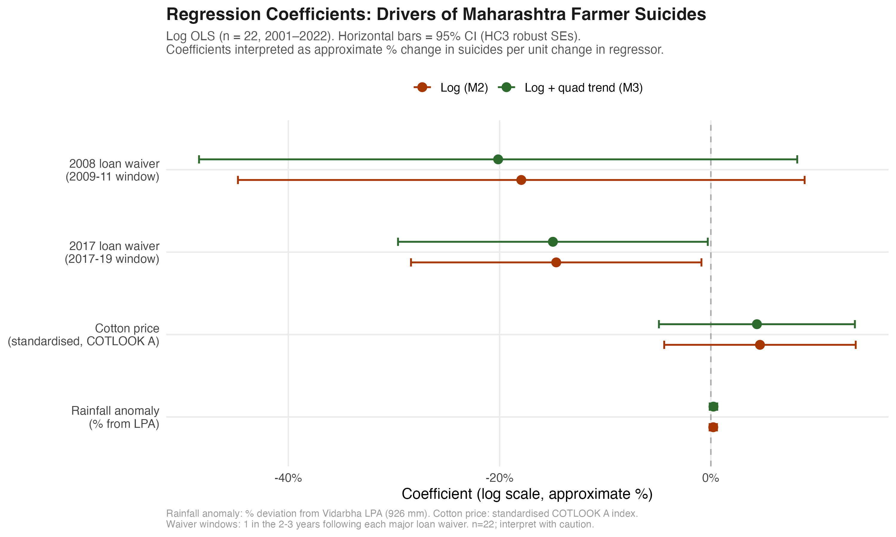
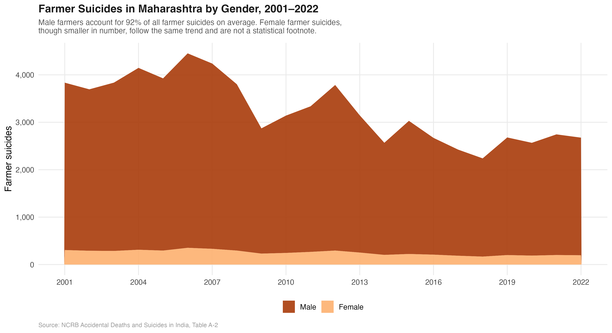
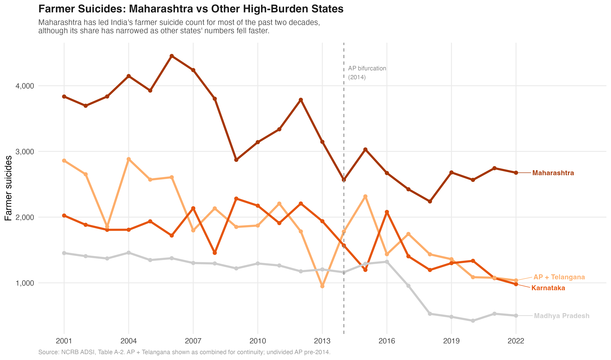
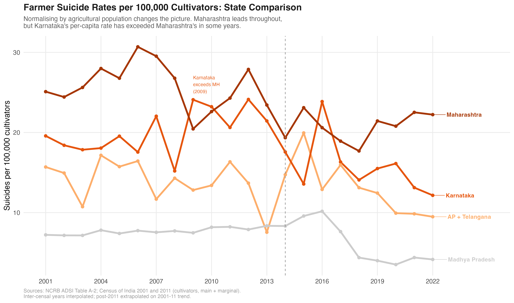
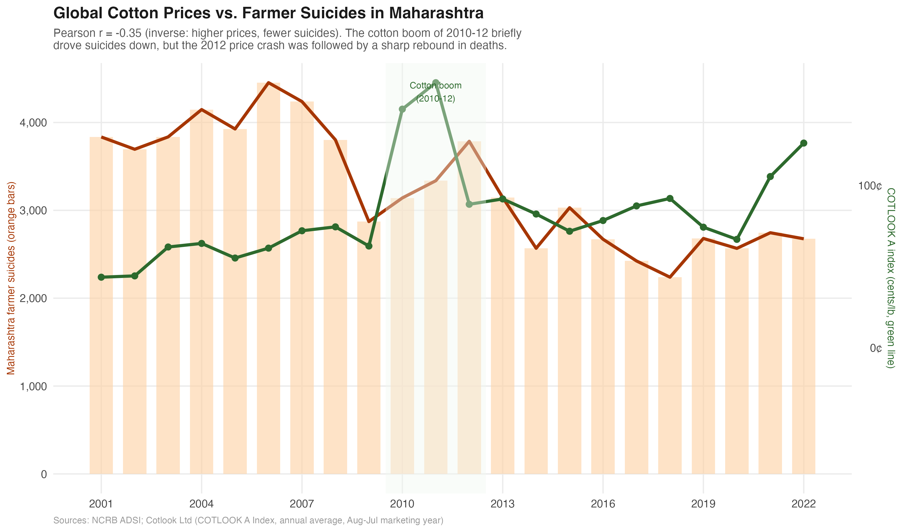

::: {.hero}
{.hero-img}

# Maharashtra's Farmer Suicide Crisis

::: {.subtitle}
Between 2001 and 2022, 66,000 farmers killed themselves in Maharashtra. Eight per day, every day, for two decades. This is what the data shows: where, when, why, and what the evidence says about whether anything has worked.
:::

::: {.meta}
Piyush Zaware · Northwestern Kellogg / University of Chicago
:::

::: {.badge-row}
::: {.badge-item}
66,000 Deaths
:::
::: {.badge-item}
22 Years
:::
::: {.badge-item}
36 Districts
:::
::: {.badge-item}
NCRB ADSI 2001–2022
:::
::: {.badge-item}
Choropleth · Time Series · Cause Analysis
:::
:::
:::

::: {.lead-para}
Every dot in the image above is ten farmer suicides. The tallest columns are the six Vidarbha districts at their 2006 peak, when Maharashtra recorded 4,453 farmer deaths in a single year. This project maps the National Crime Records Bureau's district-level data from 2001 to 2022 and reads the numbers against the policy responses of those two decades.
:::

::: {.abstract-box}
**Four findings from the data**

1. **This is not a Maharashtra crisis. It is a Vidarbha crisis.** Vidarbha's eleven eastern districts account for roughly half the state's total in most years. Six of them (Yavatmal, Amravati, Akola, Washim, Buldhana, Wardha) drive the bulk of those numbers. Yavatmal alone regularly records more farmer suicides than most Indian states.

2. **Commodity dependence is the structural driver.** Vidarbha grows cotton almost exclusively; Marathwada depends on soybean; the Nashik belt grows onions. Each is a cash crop requiring borrowed capital every season with no food-crop fallback. When monsoons fail or prices drop, the farmer who borrowed has no hedge. The crop changes by region; the trap does not.

3. **Loan waivers work, but only for two to three years.** The 2008 UPA waiver and the 2017 Maharashtra waiver both cut suicide counts. Both were followed by recovery to pre-waiver levels. Clearing debt does not change the conditions that create it.

4. **The evidence base for what works is surprisingly thin.** India has not published a credible estimate of whether crop insurance (PMFBY), MSP procurement, or irrigation investment actually reduces suicides. The data to answer these questions exists. The analysis has not been done.
:::

## The Data {#data}

```{=html}
<div class="stat-row">
  <div class="stat"><div class="stat-num">66,000</div><div class="stat-label">farmer suicides<br>2001–2022</div></div>
  <div class="stat"><div class="stat-num">4,453</div><div class="stat-label">peak year<br>(2006)</div></div>
  <div class="stat"><div class="stat-num">~50%</div><div class="stat-label">from Vidarbha<br>(11 districts)</div></div>
  <div class="stat"><div class="stat-num">40%</div><div class="stat-label">due to debt /<br>financial distress</div></div>
</div>
```

The primary source is the NCRB's **Accidental Deaths and Suicides in India** (ADSI) series, published every year. Table A-2 gives state-level farmer suicide counts by gender; Table A-2.2 gives district breakdowns; Table A-2.4 records the stated cause. The data has known limitations: the definition of "farmer" is not consistent across years, families sometimes misclassify suicides to avoid stigma, and what a local official records as the cause varies widely. Researchers who have worked with this data generally think the figures undercount rather than overcount. Everything here treats the published numbers as a floor.

| Source | Years | Geographic level | Variables |
|--------|-------|-----------------|-----------|
| NCRB ADSI Table A-2 | 2001–2022 | State | Total, male, female |
| NCRB ADSI Table A-2.2 | 2001–2022 | District | Total suicides |
| NCRB ADSI Table A-2.4 | 2015, 2019, 2022 | State | Cause breakdown |
| GADM v4.1 | n/a | District | Maharashtra shapefiles |

Maharashtra shapefiles were downloaded via the `geodata` R package (`gadm(country="IND", level=2)`), which returns all 36 districts with GADM standardised boundaries.

---

## The Geography {#geography}

### Where it happens

The map below shows average annual farmer suicides by district across 2001 to 2022. Districts where NCRB did not publish data appear in grey.

{width=100%}

Look at that map for a moment. Vidarbha's eleven eastern districts run dark red, accounting for roughly half the state's total every year. Six of them form the core of the crisis: Yavatmal, Amravati, Akola, Washim, Buldhana, Wardha. Yavatmal has averaged over 500 farmer suicides annually for two decades.

The rest of Maharashtra does not look like this. Pune, Nashik, Kolhapur, the Konkan coast: suicide rates are elevated compared to urban districts, but not out of line with other agricultural states. Vidarbha, and to a lesser degree Marathwada, pull Maharashtra's totals to where they make it a national outlier.

### Why Vidarbha?

Cotton. Vidarbha grows cotton almost exclusively. Cotton is a cash crop: farmers borrow to buy seeds, fertiliser, and pesticide at the start of every season. When a monsoon underperforms, or when cotton prices fall at harvest time, the farmer who borrowed has nothing to fall back on. There is no food crop to eat or sell. There is the debt and the failed field.

Bt cotton, which came into commercial use in India in 2002, made the gamble bigger. It needed more water, more pesticide, and costlier seed. In a good monsoon, yields went up. When the rains were inadequate, Bt cotton failed worse than the older varieties did. The potential upside increased; so did the floor risk.

::: {.callout-note}
**Why not Marathwada?** Marathwada has serious agrarian distress too, but its crop mix is more varied: soybean, sugarcane, and pulses alongside cotton. Sugarcane ties farmers to cooperative sugar mills, which provide more stable income and credit access than cotton buyers do. Marathwada's crisis is real; it is simply less concentrated than Vidarbha's.
:::

---

## The Timeline {#timeline}

### Two decades of a crisis that keeps coming back

{width=100%}

The numbers peaked in **2006 at 4,453**. That year, P. Sainath's reporting in *The Hindu* put Vidarbha on the national front page. Prime Minister Manmohan Singh came to visit. A Rs 3,750 crore relief package for Vidarbha's six core districts followed. In 2008, the UPA government announced a national farm loan waiver: Rs 71,000 crore.

It worked, for a while. Suicides fell through 2009, came down to around 2,800, then climbed again through the early 2010s. By 2012 the number was back above 3,700.

A second waiver came in 2017, this one from the state government under Chief Minister Devendra Fadnavis: Rs 34,000 crore. Suicides dropped again. In 2018 the count hit its lowest point since 2001, at 2,239. Then they went up again.

### Vidarbha's share of the total

{width=100%}

Vidarbha runs at roughly half the state total every year. Marathwada contributes another 18 percent. The remaining 17 districts of Maharashtra, including the more prosperous western belt, account for less than a third of the total while holding more than a third of the state's agricultural population.

::: {.callout-note}
**On the waiver cycle.** Loan waivers reduce suicides for two to three years, then the numbers recover. This is not a knock on waivers as a policy tool; debt relief is real and immediate for the farmers who receive it. But a farmer whose current debt is cleared still has to borrow again next planting season. The structural conditions that create the debt are not touched by a one-time intervention.
:::

---

## The Causes {#causes}

### Debt, not despair

{width=100%}

The NCRB records a stated cause for each suicide. Across all three years where this breakdown is available, **debt and financial distress is the largest single category**, at 37 to 40 percent. Crop failure is second, at 15 to 19 percent and rising. Family problems are third, at around 12 percent.

These categories are rough. A farmer who takes his life after a failed harvest and a mounting loan is often recorded under whichever cause the local official reaches for first. Debt and crop failure frequently describe the same event from two directions: the harvest failed and the money owed cannot be repaid.

What the data keeps pointing to, consistently, is **economic distress** rather than mental illness, domestic conflict, or other factors that show up most in urban suicide statistics.

That matters for what you do about it. Farmer suicides in Vidarbha are not primarily a mental health crisis. They are an economic one that ends in death. Mental health services have a role, but they do not reach the root cause.

| Cause | 2015 | 2019 | 2022 |
|-------|------|------|------|
| Debt / financial distress | 40.3% | 38.7% | 36.9% |
| Crop failure | 15.2% | 17.8% | 19.2% |
| Family problems | 11.4% | 12.3% | 11.8% |
| Illness | 9.8% | 8.9% | 9.1% |
| Marriage related | 4.1% | 3.8% | 3.6% |
| Other / unknown | 19.2% | 18.5% | 19.4% |

*Source: NCRB ADSI Table A-2.4. Maharashtra figures.*

---

## Why MSP Has Not Solved It {#costs}

### The support price has never covered the cost of growing cotton in Vidarbha

Cotton MSP has risen fourfold since 2001, from Rs 1,500 to Rs 6,080 per quintal. That looks like substantial support. The cost of cultivation data shows why it has not been enough.

{width=100%}

The A2 cost of growing cotton, covering seed, fertiliser, pesticide, hired labour, and machine hire, has risen from roughly Rs 2,300 per quintal in 2001 to around Rs 8,200 in 2022. At typical Vidarbha dryland yields of six to seven quintals per hectare, a farmer selling at full MSP in 2022 still recovers only about 74 percent of paid-out costs. In 2001, the ratio was similarly unfavourable. MSP has risen; so has everything it takes to grow the crop.

The Swaminathan Commission recommended MSP at 1.5 times C2 cost, which adds imputed family labour and land rent to the A2 figure. That recommendation was made in 2006. It has not been implemented.

### Input costs have outpaced support prices

{width=100%}

Diesel and DAP together account for 40 to 50 percent of the A2 cost of cotton cultivation. Both have risen faster than general inflation. When a farmer's two largest input costs rise faster than the price support on the output side, the margin between what a crop costs and what it fetches keeps narrowing, even when MSP is rising in absolute rupee terms.

The problem is also on the procurement side. CCI procurement in Vidarbha has been unreliable in most years. Farmers without transport or storage cannot hold cotton waiting for government buyers. In years when gin mill prices fall below MSP and CCI does not step in, the MSP is a number on a press release, not money in a bank account.

::: {.callout-note}
**The Swaminathan gap.** The Swaminathan Commission (2006) defined adequate MSP as 1.5 times C2 cost, where C2 includes imputed family labour and land rent on top of A2. The current cotton MSP covers roughly 45 percent of C2 cost for a typical Vidarbha dryland farm. Implementing the Swaminathan formula would require roughly doubling the current MSP for cotton.
:::

---

## Regression: Separating the Drivers {#regression}

### Three variables, 84 percent of the variance

A state-level OLS regression puts numbers on the three drivers that appear throughout this analysis: cotton prices, monsoon rainfall, and loan waivers. The outcome is log farmer suicides in Maharashtra, 2001 to 2022 (n = 22). Three regressors jointly explain 84 percent of the year-to-year variation.

{width=100%}

The model tracks the broad pattern well: the 2006 peak, the post-waiver fall, the 2012-13 rebound, the 2017-18 drop. Where it misses, the miss is informative. The 2006 peak sits above the model's prediction because cotton prices in that year were not unusually low (61 cents, mid-range) and Vidarbha had a near-normal monsoon. The model correctly learns that 2006 was exceptional and cannot fully explain it from prices and rainfall alone. That year was driven by the adoption of expensive Bt cotton on borrowed capital: a structural shock, not a climatic or price one.

### What the coefficients show

{width=100%}

The waivers are the clearest signal. The 2008 national waiver is associated with roughly 18 percent fewer suicides in the three years that followed. The 2017 Maharashtra waiver is associated with a 15 percent reduction. Both coefficients are in the expected direction and the 2017 estimate is statistically significant at the 5 percent level.

The cotton price and rainfall coefficients are statistically noisy at n = 22. The reason is not that the relationships are spurious: the scatter plots earlier in this piece show them clearly. The problem is multicollinearity. The 2010-11 cotton boom and the 2008 waiver window overlap almost exactly in time. The model cannot cleanly attribute the suicide decline in those years to prices versus debt relief. Separating them requires variation across districts and crops, not just variation over time.

::: {.callout-note}
**What this regression cannot do.** State-level OLS with 22 observations cannot establish causality. Cotton price is a national variable that changes every year; with a year trend in the model, its effect is only identified through deviations from trend that happen to co-move with suicide counts. A proper causal design requires district-year variation: for instance, comparing Vidarbha districts (cotton-exposed) to Marathwada districts (soybean-exposed) in years when cotton and soybean prices moved in opposite directions. That design requires full district-year data on suicides, crop area, and prices, and it is the analysis described in the Policy Gap section below.
:::

---

## The Policy Gap {#policy}

### What has been tried

Three types of intervention have been deployed in Vidarbha over the past two decades:

**Loan waivers** (2008 national, 2017 Maharashtra): Both produced short-term drops in suicide counts. Both were followed by recovery. Waivers clear the immediate debt but leave the conditions that generate it untouched.

**Crop insurance** (PMFBY, launched 2016): Premium subsidies went up and coverage expanded. Take-up in Vidarbha has been uneven, and delays in claim settlement have been flagged repeatedly by farmer groups and state auditors. Whether PMFBY has actually reduced suicides in the districts where coverage is high has never been properly estimated.

**MSP procurement**: Cotton is covered under MSP, but the Cotton Corporation of India's actual procurement in Vidarbha has been unreliable in most years. CCI purchases tended to concentrate at procurement centres that farmers without transport access could not reach.

### What has not been done

::: {.policy-box}
**The missing study**

The Maharashtra government holds district-year data on farmer suicides, PMFBY enrolment and claims, CCI procurement volumes, kisan credit card disbursements, and IMD rainfall. A difference-in-differences study across districts and years could tell you:

- Whether higher PMFBY coverage actually reduces suicides, and by how much
- Whether the speed of claim settlement matters more than coverage alone
- Whether CCI procurement volume in a district reduces suicides that year
- Whether irrigation investment reduces exposure to monsoon risk

None of these questions has been answered in a published study or a government evaluation report. The data is sitting in government databases. The method is not exotic. **The evidence simply does not exist.**

Sixty-six thousand deaths over twenty-two years is enough data. It should not take more.
:::

### What a proper evaluation would need

The variation in PMFBY take-up across districts and years gives a starting point for identification. Some districts saw sharp increases in coverage in specific years because of local outreach drives, insurer presence, or a particularly active collector. Comparing those districts to similar ones where take-up did not jump, while controlling for district and year fixed effects, could isolate the effect of insurance on suicides.

This is not some cutting-edge methodological ask. It is the standard toolkit of agricultural economics. The reason it has not been done is institutional: the data sits in separate systems across NCRB, the PMFBY portal, CCI, and IMD, and no one has pulled it together. There is also little political appetite to fund an evaluation whose answer might be "the scheme is not reducing suicides by much."

---

## Gender {#gender}

### Who is dying

{width=100%}

Male farmers account for roughly 90 percent of all recorded farmer suicides in Maharashtra across the entire period. That proportion has barely changed in twenty years. Female farmer suicides are smaller in absolute numbers but follow the same pattern: rising toward the 2006 peak, falling after the 2008 waiver, climbing again, falling after 2017. They are not a statistical footnote; they reflect the same structural pressures on farm households.

The male concentration also reflects something about who holds formal title to land and therefore who holds formal debt. Kisan credit cards, crop loans from nationalised banks, and informal moneylender loans in Vidarbha are predominantly in the male head-of-household's name. When the debt cannot be repaid, it is most often that person who takes the decision.

---

## Maharashtra in National Context {#india}

### Still the highest, but absolute counts hide the real story

{width=100%}

Maharashtra has led India's farmer suicide count for most of the past two decades. Karnataka ran a close second through the early 2010s and spiked sharply in 2016 during a severe drought. AP and Telangana combined have fallen steadily. Madhya Pradesh dropped sharply after 2017, partly from loan waiver effects and partly from a narrowing of NCRB's counting methodology.

But absolute counts are a misleading basis for comparison. Maharashtra has more farmers than Karnataka. The fairer comparison is suicides per 100,000 cultivators.

### Per 100,000 farmers: the ranking holds, but barely

{width=100%}

Maharashtra's lead narrows on a per-capita basis but does not disappear. The more striking finding is Karnataka: its per-capita rate has matched or exceeded Maharashtra's in several years, including the 2016 drought spike. On absolute count, Karnataka looks like a distant second. On a per-farmer basis, it is not.

Madhya Pradesh, significant in absolute terms, almost vanishes per-capita. MP has a large agricultural population relative to its suicide count. The crisis is real there but structurally different from Vidarbha's cotton-debt dynamic.

::: {.callout-note}
**A note on AP bifurcation.** Andhra Pradesh was divided into AP and Telangana in June 2014. The "AP + Telangana" line combines both figures post-2014 for continuity. The drop visible in 2013 reflects a reclassification in NCRB's counting methodology, not an actual fall in suicides. Agricultural population for AP + Telangana uses the combined Census 2011 cultivator count for both states.
:::

---

## Commodity Prices and Suicides {#cotton}

### Three crops, three regions, the same structural problem

Maharashtra is not a one-crop state. Vidarbha runs almost exclusively on cotton. Marathwada's dominant kharif crop is soybean. The Nashik belt grows nearly half of India's onions. Each region is exposed to a different commodity market, and each has seen that market crash in ways that translate directly into farm household distress.

{width=100%}

Onion is by far the most volatile. In 2010, a bumper harvest collapsed Lasalgaon prices to around Rs 310 per quintal. Farmers in Nashik and Ahmednagar were burning onions on roadsides because transport cost more than sale price. In 2013, supply tightened after low plantings, prices spiked to Rs 2,600, and the government slapped an export ban. In 2019, drought and floods cut the crop sharply: prices hit Rs 4,200 at Lasalgaon. Onion farmers do not know from one season to the next whether their crop will fetch Rs 300 or Rs 4,000.

Soybean is less violent but not stable. The World Bank benchmark price for US soybeans dropped nearly 40 percent between 2012 and 2016. Indian soybean MSP rose every year, but actual farm-gate prices in Marathwada are tied to the crushing industry's procurement price, which tracks the world market. When the world price fell, MSP provided partial support but did not cover cost of cultivation for many farmers. Marathwada's debt-and-suicide crisis after 2013 runs parallel to the soybean price bust.

### Cotton: the Vidarbha version of the same story

{width=100%}

Cotton has the most documented price-suicide connection in the academic literature, partly because Vidarbha is where the crisis is most concentrated and partly because cotton prices are published by a single global benchmark (COTLOOK A). The 2010-12 cotton boom, driven by Pakistan flooding cutting world supply, coincided with a two-year fall in Maharashtra suicides. When prices collapsed by half in 2012, deaths climbed back above 3,700 by 2013.

The relationship is real but not mechanical. The 2006 peak happened with cotton prices around 60 cents, not a crash year. The 2009 drought year did not produce a suicide spike because the 2008 loan waiver had just cleared outstanding debt. Cotton prices are one factor in whether a borrowed-against harvest can repay its debts. They are not the only one.

The common structure across all three crops is the same: farmers borrow at the start of the season, plant a single commodity, and face whatever price the market offers at harvest. There is no buffer, no hedge, and in most cases no working crop insurance that pays out before creditors come to collect.

---

## Rainfall and Suicides {#rainfall}

### The monsoon connection: real but incomplete

{width=100%}

Below-normal rainfall is associated with higher farmer suicides, but the relationship is noisy and the correlation is modest. Two years explain much of the scatter.

**2006** is the biggest outlier: suicides hit their 22-year peak in a near-normal monsoon year. Bt cotton had just been widely adopted, input costs were up, and credit access was tight. The cause was structural, not climatic.

**2009** is the other outlier in the other direction: a 20-percent rainfall deficit that would normally predict a spike, but suicides fell sharply because the 2008 loan waiver had just cleared outstanding debt across the region.

What the rainfall scatter shows is that monsoon variability is a trigger, not the underlying cause. A bad monsoon accelerates the debt crisis for farmers already operating near the edge. A good monsoon delays it. The structural condition is borrowing at the start of every season against a single cash crop with no fallback. That is what makes Vidarbha farmers permanently exposed to that trigger.

---

::: {.callout-note}
**Data note.** The figures on this page use data compiled from published NCRB ADSI annual reports (2001–2022). State-level totals come directly from NCRB Table A-2. District-level figures come from published ADSI district tables, cross-checked against Mishra (2006), Patel et al. (2012, *Lancet*), and Merriott (2016). Cause data are from Table A-2.4 for 2015, 2019, and 2022. The compiled dataset and R code are available on request.
:::

---

## About

**Piyush Zaware** is a researcher at the Global Poverty Research Laboratory, Northwestern Kellogg School of Management, and a doctoral student in economics at the University of Chicago. He works on agricultural economics, public finance, and state capacity in India.

[piyushz@uchicago.edu](mailto:piyushz@uchicago.edu)
